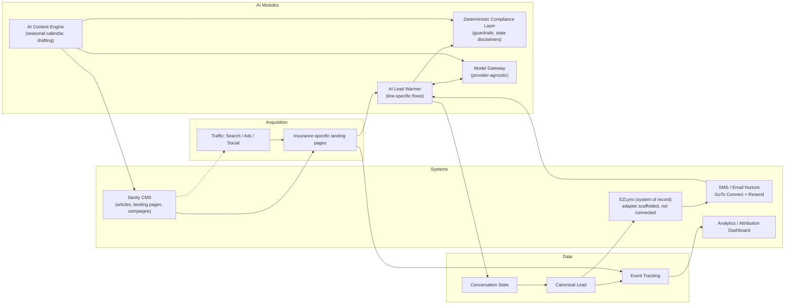

# Architecture

## Stack

- **Frontend/app:** Next.js (App Router) + TypeScript + Tailwind, deployed on Vercel
- **CMS:** Sanity (favored per handoff doc since automation/content-engine is central)
- **Data:** PostgreSQL/Supabase (project `ybdfaelmwtgvftuztxyy`) via Drizzle ORM — **live and verified** for leads/claims/contact messages, see "Durable persistence" below
- **AI:** model-provider-agnostic gateway (no hard dependency on a single LLM vendor)
- **CRM/AMS of record:** EZLynx (confirmed) — stays system of record; this platform normalizes and pushes leads to it rather than replacing it
- **SMS/Email nurture:** **GoTo Connect (SMS, existing service) + Resend (email)** — working decision, see rationale below
- **Internal notifications:** GoTo SMS to agency staff on new lead/contact/claim — see "GoTo integration" below
- **CRM push:** EZLynx adapter scaffolded (`src/lib/integrations/ezlynx/adapter.ts`), not yet connected — API access is gated, see "EZLynx integration status" below
- **Platform monitoring:** `@vercel/analytics` (page-view/visitor analytics) + `@vercel/speed-insights` (Core Web Vitals) — zero-config, auto-activate on Vercel deploys, no-op locally. Distinct from GA4: this is Vercel's own dashboard, not a replacement for the marketing-funnel tracking in `src/lib/analytics/track.ts`.

## Module diagram



## Repo structure (this app)

```
EliteInsuranceGroup/
├── docs/                     # planning artifacts (this audit/foundation pass)
├── src/
│   ├── app/                  # Next.js routes
│   ├── lib/
│   │   ├── schemas/          # lead.ts, conversation.ts (zod) — canonical shapes
│   │   ├── compliance/       # guardrails.ts, states.ts, disclaimers.ts
│   │   └── config/
│   │       └── agency.ts     # Elite-specific data — the one file to swap to retarget the platform
├── package.json, tsconfig.json, tailwind.config.ts
```

Elite-specific branding/business rules live only in `src/lib/config/agency.ts`; everything else should read from it rather than hardcoding agency details, per the doc's productization thesis (this is the first agency-specific deployment of a reusable platform).

## SMS/email nurture provider decision

**Superseded 2026-08-21: Elite already runs GoTo for phone service.** The original Twilio decision (below, kept for history) was made under the assumption that no SMS platform existed — that assumption was wrong. GoTo Connect has a real Messaging V2 API (`messaging.v1.send` OAuth scope, `POST https://api.goto.com/messaging/v1/messages`), so SMS goes through the phone system Elite already pays for instead of standing up a second account.

**Decision: GoTo Connect for SMS, Resend for email.** Resend is unchanged from the original decision — GoTo's Messaging V2 "Email channel" is a shared-inbox/reply feature for customer conversations, not a transactional/bulk sender, so it isn't a Resend replacement.

What's actually built this pass (`src/lib/integrations/goto/client.ts`): Personal Access Token exchange (`grant_type=personal_access_token`) + `sendSms()`. There's no nurture/resume engine yet (that's the AI Lead Warmer, still Phase 2), so the immediate use is **internal SMS notifications to agency staff** on new leads/contact messages/claims (`src/lib/notifications/leadNotify.ts`, wired into all 3 form API routes) — directly serves "reduce agent time / faster response" without needing the full nurture engine to exist first.

**2026-08-21: switched from OAuth Authorization Code to Personal Access Token.** The original refresh-token flow required a one-time browser login through a local callback route and carried the risk of GoTo rotating the refresh token out from under an env var with no persistence layer to catch it. A PAT (generated once at myaccount.goto.com > Developer Tools, on an OAuth client with "Personal Access Token" enabled at developer.logmeininc.com/clients) is long-lived and doesn't rotate — verified against GoTo's own docs, not guessed — so the `oauth/start`/`oauth/callback` helper routes were removed as dead code. Full setup steps in `.env.example`.

<details>
<summary>Original Twilio decision (2026-08-21, superseded same day)</summary>

Both Twilio and Resend were considered programmable, code-first APIs rather than templated marketing-blast tools — the right fit given `ConversationState` (`src/lib/schemas/conversation.ts`) needs to be resumed via an inbound SMS reply or an email click, not just receive a one-way campaign send. Twilio specifically was picked over all-in-one local-service platforms (Podium, Birdeye — built around their own inbox UI, a poor fit for a custom stateful resume flow) and marketing-automation suites (HubSpot, ActiveCampaign — cost/lock-in for capability this build already owns). Moot now that GoTo covers SMS; Resend's reasoning (better React/Next.js DX than SendGrid via `react-email`) still stands for email.

</details>

**2026-08-22: Resend confirmation emails built and live-verified.** `src/lib/integrations/resend/client.ts` (fallback-safe, same contract as every other integration here) + `src/lib/notifications/emailNotify.ts` send a customer-facing confirmation email on quote/contact/claim submission (`RequestConfirmationEmail`, `src/components/emails/`, built with `@react-email/components` per the DX reasoning above). This is distinct from `leadNotify.ts`'s internal staff SMS — email goes to the customer, SMS goes to the agency. Copy is non-binding by design (see the disclaimer line in the template), matching `guardrails.neverImplyCoverageBound`, and directly fulfills the line already in `disclaimers.noBindingViaForm`: "...with an email confirmation of the request."

Verified live: a standalone send returned a real Resend message ID, and a real `/contact` form submission in the browser produced a `201` with no send errors logged. **Domain not verified yet** — sends currently go through Resend's shared `onboarding@resend.dev` sandbox sender, which Resend restricts to delivering only to the email address on the Resend account itself. Real customers won't receive these until `RESEND_FROM_EMAIL` is set to an address on a domain verified in Resend (SPF/DKIM, resend.com/domains) — see `.env.example`.

Still required before Phase 2 nurture ships: the full conversational resume engine (this pass is a one-way confirmation, not two-way nurture) and wiring `contact.smsConsent`/consent tracking (already in `src/lib/schemas/lead.ts`) through to GoTo's opt-out handling.

## Durable persistence

Leads, claims, and contact messages persist to Postgres (Supabase project `ybdfaelmwtgvftuztxyy`) via Drizzle ORM — **live and verified this pass**, not just built. Replaces the earlier in-memory-only stores flagged throughout `src/lib/leads/store.ts` etc. as non-durable.

**Connection setup, verified against current Supabase behavior (not assumed):**
- `DATABASE_URL` — the transaction pooler (Supavisor, port 6543), used by the app at runtime. Required for serverless: Postgres has a low connection limit and Vercel functions open a new connection per invocation.
- `DIRECT_URL` — used only by `drizzle-kit` for migrations. **Not** Supabase's literal "direct connection" (`db.[ref].supabase.co:5432`) — that hostname is IPv6-only now and fails DNS resolution (`ENOTFOUND`) from IPv4-only networks, which is exactly what happened when this was first wired up. Uses the **session pooler** instead (same pooler host as `DATABASE_URL`, port 5432 instead of 6543) — IPv4-compatible and supports the session-level behavior migrations need, per Supabase's own documented fix for this.
- `prepare: false` is required on the `postgres.js` driver — transaction-mode pooling doesn't support prepared statements, which the driver uses by default.

**Schema shape:** JSONB + a few indexed columns (`src/lib/db/schema.ts`), not a fully normalized schema. `data jsonb` holds the full zod-validated object (`Lead`/`StoredClaim`/`StoredContactMessage`) so the DB doesn't need a migration every time those types evolve; a handful of real columns (`line`, `lead_score_tier` on leads; `policy_number` on claims) exist only for the filtering/sorting queries that actually matter.

**Fallback-safe**: if `DATABASE_URL` isn't set, `src/lib/db/client.ts` returns `null` and the 3 store modules fall back to their original in-memory arrays — same no-op-safe contract as every other integration in this project (GA4, GoTo, EZLynx). Confirmed with a build run with the env var unset.

**Migrations**: `npm run db:generate` (writes SQL to `migrations/`, committed to the repo) then `npm run db:migrate` (applies against `DIRECT_URL`).

## EZLynx integration status

Per the CRM/AMS pattern in the handoff doc: `website → AI service → normalized lead → CRM/AMS → assignment/tasks/SMS/email/pipeline`. The AI lead warmer (and today, the quote forms) produce a canonical `Lead` (see `src/lib/schemas/lead.ts`), and `src/lib/leads/mappers.ts`/`src/app/api/quote/route.ts` call an EZLynx adapter to push it.

**Scaffolded, not connected.** `src/lib/integrations/ezlynx/adapter.ts` exists and is wired into the quote flow, but EZLynx's API is partner/enterprise-gated (OAuth2, not self-serve — confirmed via EZLynx's own published API solutions page) and Elite currently only has a portal login, not API credentials. Building real request logic against guessed endpoints would fabricate something that looks connected but isn't, so the adapter honestly reports `{status: "not-connected"}` until real credentials exist. What to request from EZLynx/Applied Systems is in `docs/open-questions.md`.

## Blog / Sanity CMS

`/blog` and `/blog/[slug]` (`src/app/blog/`) read from Sanity via `src/lib/sanity/` — **live and verified this pass**, not just built. `src/lib/sanity/client.ts` is fallback-safe like every other integration here: if `NEXT_PUBLIC_SANITY_PROJECT_ID`/`NEXT_PUBLIC_SANITY_DATASET` aren't set, the blog renders with zero posts instead of failing the build.

**Content model:** a `post` document (no Sanity Studio deployed yet — documents are written directly via the API, see below) with `title`, `slug`, `excerpt`, `author`, `publishedAt`, `insuranceLines` (tags against the existing `InsuranceLine` type), `body` (Portable Text blocks, rendered via `@portabletext/react`), and `status: "draft" | "published"`. `src/lib/sanity/queries.ts` only ever fetches `status == "published"` for the public site — draft posts exist in the dataset but 404 if visited directly.

**Approval workflow:** per `guardrails.requireHumanReviewForHigherRiskRecommendations` (`src/lib/compliance/guardrails.ts`), net-new AI-drafted posts seed as `status: "draft"` rather than going live automatically — they're visible in the Sanity dataset for `agency.complianceApprover` (Chaz Goodin) to review, and flipping `status` to `"published"` (currently done by editing the document directly, since no Studio UI exists yet) is what puts them on the site. Migrated posts that were already live and previously published on the old Squarespace site seed as `status: "published"` directly, since that's a platform migration, not new claims requiring fresh sign-off.

**Content so far** (`scripts/seed-sanity-posts.mjs`, re-runnable — uses `createOrReplace` so it's safe to run again after editing): the 6 existing blog posts migrated verbatim from `eliteinsuranceknoxville.com/elite-insurance-blog` (published), plus 6 new posts covering high-ROI/priority lines — general liability, commercial auto, boat (East TN lake-focused), group life, workers' comp (Tennessee-specific, coverage threshold verified against `tn.gov`/`lwdsupport.tn.gov`, not guessed), and builders risk (draft, pending review).

**Editing UI:** Sanity Studio is embedded at `/studio` (`sanity.config.ts` + `src/app/studio/[[...tool]]/page.tsx`, schema in `src/sanity/schemaTypes/`) — this is where Chaz reviews the draft posts and flips `status` to `"published"` to put them live, rather than editing raw documents via script. `/studio` needed its own layout tree without the site's Header/Footer, which is why the marketing site now lives under the `(site)` route group (`src/app/(site)/`, its own `layout.tsx` with Header/Footer) — the true root `src/app/layout.tsx` only holds html/body/fonts/GA/Vercel Analytics now, shared by both `(site)` and `/studio`. URLs are unaffected; route groups don't appear in the path.

**One remaining manual step (owner, not something I can do remotely):** Sanity gates Studio access behind CORS origin allowlisting per project. On first visiting `/studio`, Sanity shows an "Add CORS origin" prompt/link (to `sanity.io/manage`) — click it while logged into the Sanity account that owns the project, confirm "Allow credentials" is checked, and save. Needed once for `http://localhost:3000` (local dev) and again for the production domain once `/studio` is deployed live.

Not yet built: the restaurant-insurance worked example from `/new-page-2` stays unpublished — per the agency owner, it's a structural reference for future posts rather than being published itself.
