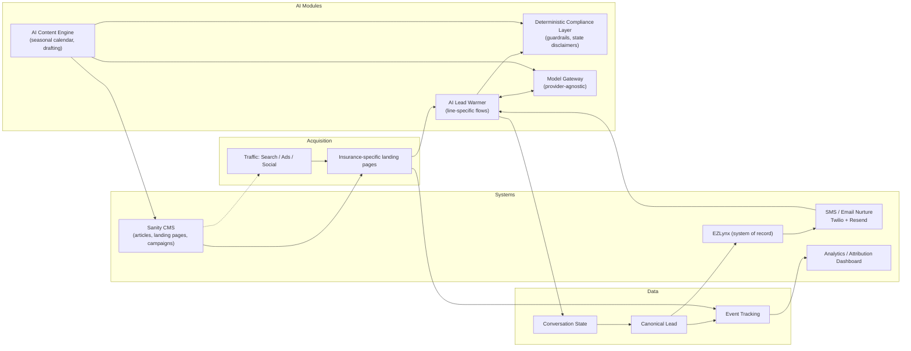

# Architecture

## Stack

- **Frontend/app:** Next.js (App Router) + TypeScript + Tailwind, deployed on Vercel
- **CMS:** Sanity (favored per handoff doc since automation/content-engine is central)
- **Data:** PostgreSQL/Supabase for leads, conversations, events (as needed beyond what CRM/AMS holds)
- **AI:** model-provider-agnostic gateway (no hard dependency on a single LLM vendor)
- **CRM/AMS of record:** EZLynx (confirmed) — stays system of record; this platform normalizes and pushes leads to it rather than replacing it
- **SMS/Email nurture:** **Twilio (SMS) + Resend (email)** — working decision, see rationale below

## Module diagram



## Repo structure (this app)

```
EliteInsuranceGroup/
├── docs/                     # planning artifacts (this audit/foundation pass)
├── src/
│   ├── app/                  # Next.js routes
│   ├── lib/
│   │   ├── schemas/          # lead.ts, conversation.ts (zod) — canonical shapes
│   │   ├── compliance/       # guardrails.ts, states.ts, disclaimers.ts
│   │   └── config/
│   │       └── agency.ts     # Elite-specific data — the one file to swap to retarget the platform
├── package.json, tsconfig.json, tailwind.config.ts
```

Elite-specific branding/business rules live only in `src/lib/config/agency.ts`; everything else should read from it rather than hardcoding agency details, per the doc's productization thesis (this is the first agency-specific deployment of a reusable platform).

## SMS/email nurture provider decision

Elite has no marketing-automation or SMS platform today — Outlook is a mailbox, not an engine that can run the abandoned-conversation resume flows the handoff doc calls for. Agency owner authorized proceeding on the assumption that a service will be purchased (2026-08-21), so this is a working decision, not an open question — but the actual accounts/API keys still need to be provisioned before Phase 2 nurture ships.

**Decision: Twilio for SMS, Resend for email.** Both are programmable, code-first APIs rather than templated marketing-blast tools — the right fit given `ConversationState` (`src/lib/schemas/conversation.ts`) needs to be resumed via an inbound SMS reply or an email click, not just receive a one-way campaign send.

Why not the alternatives:
- **All-in-one local-service platforms** (e.g. Podium, Birdeye) are built around their own inbox/webchat UI and templated campaigns — a poor fit for driving a custom, stateful AI conversation resume flow from server code.
- **Marketing-automation suites** (HubSpot, ActiveCampaign) add cost and platform lock-in for capability this build already owns (the conversation engine, lead scoring, compliance layer) — they'd mostly duplicate work already done in `src/lib/`.
- **SendGrid** (Twilio's own email product) was considered instead of Resend but Resend has a notably better developer experience for a React/Next.js stack (native `react-email` templates) at comparable deliverability for this scale.

Required setup before this goes live (not done this session): Twilio account + **10DLC campaign registration** (required for US A2P SMS, has a review lag — start this early), Resend account + domain verification (SPF/DKIM) on the production domain, and wiring `contact.smsConsent`/consent tracking (already in `src/lib/schemas/lead.ts`) through to both providers' opt-out handling.

## Why EZLynx stays system of record

Per the CRM/AMS pattern in the handoff doc: `website → AI service → normalized lead → CRM/AMS → assignment/tasks/SMS/email/pipeline`. The AI lead warmer produces a canonical `Lead` (see `src/lib/schemas/lead.ts`) and an EZLynx-specific adapter (future work, not built this session) translates it into EZLynx's lead/applicant format rather than replacing EZLynx as the operational system agents work from day-to-day.
