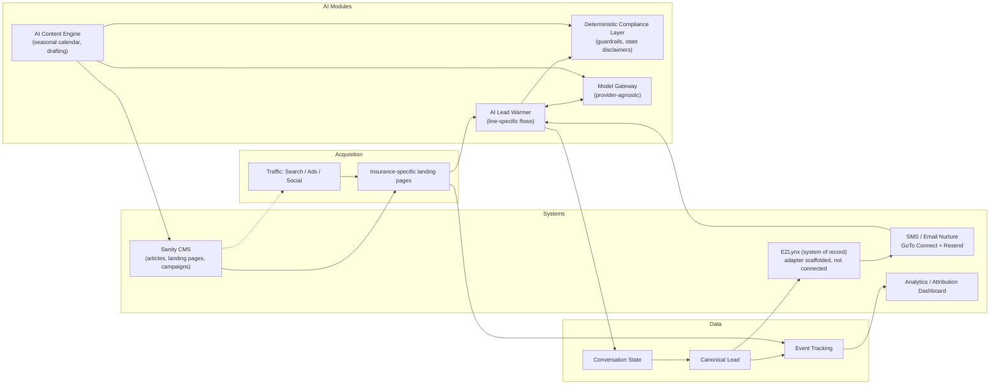

# Architecture

## Stack

- **Frontend/app:** Next.js (App Router) + TypeScript + Tailwind, deployed on Vercel
- **CMS:** Sanity (favored per handoff doc since automation/content-engine is central)
- **Data:** PostgreSQL/Supabase for leads, conversations, events (as needed beyond what CRM/AMS holds)
- **AI:** model-provider-agnostic gateway (no hard dependency on a single LLM vendor)
- **CRM/AMS of record:** EZLynx (confirmed) — stays system of record; this platform normalizes and pushes leads to it rather than replacing it
- **SMS/Email nurture:** **GoTo Connect (SMS, existing service) + Resend (email)** — working decision, see rationale below
- **Internal notifications:** GoTo SMS to agency staff on new lead/contact/claim — see "GoTo integration" below
- **CRM push:** EZLynx adapter scaffolded (`src/lib/integrations/ezlynx/adapter.ts`), not yet connected — API access is gated, see "EZLynx integration status" below

## Module diagram



## Repo structure (this app)

```
EliteInsuranceGroup/
├── docs/                     # planning artifacts (this audit/foundation pass)
├── src/
│   ├── app/                  # Next.js routes
│   ├── lib/
│   │   ├── schemas/          # lead.ts, conversation.ts (zod) — canonical shapes
│   │   ├── compliance/       # guardrails.ts, states.ts, disclaimers.ts
│   │   └── config/
│   │       └── agency.ts     # Elite-specific data — the one file to swap to retarget the platform
├── package.json, tsconfig.json, tailwind.config.ts
```

Elite-specific branding/business rules live only in `src/lib/config/agency.ts`; everything else should read from it rather than hardcoding agency details, per the doc's productization thesis (this is the first agency-specific deployment of a reusable platform).

## SMS/email nurture provider decision

**Superseded 2026-08-21: Elite already runs GoTo for phone service.** The original Twilio decision (below, kept for history) was made under the assumption that no SMS platform existed — that assumption was wrong. GoTo Connect has a real Messaging V2 API (`messaging.v1.send` OAuth scope, `POST https://api.goto.com/messaging/v1/messages`), so SMS goes through the phone system Elite already pays for instead of standing up a second account.

**Decision: GoTo Connect for SMS, Resend for email.** Resend is unchanged from the original decision — GoTo's Messaging V2 "Email channel" is a shared-inbox/reply feature for customer conversations, not a transactional/bulk sender, so it isn't a Resend replacement.

What's actually built this pass (`src/lib/integrations/goto/client.ts`): OAuth 2.0 Authorization Code flow (refresh-token based, since it's user-delegated access, not client-credentials) + `sendSms()`. There's no nurture/resume engine yet (that's the AI Lead Warmer, still Phase 2), so the immediate use is **internal SMS notifications to agency staff** on new leads/contact messages/claims (`src/lib/notifications/leadNotify.ts`, wired into all 3 form API routes) — directly serves "reduce agent time / faster response" without needing the full nurture engine to exist first.

One-time setup (owner, not something I can do remotely): register an OAuth app at developer.goto.com, set `GOTO_CLIENT_ID`/`GOTO_CLIENT_SECRET` in `.env.local`, register `http://localhost:3000/api/integrations/goto/oauth/callback` as an allowed redirect URI, then visit `/api/integrations/goto/oauth/start` locally to complete the one-time login and get a refresh token for `GOTO_REFRESH_TOKEN`. Full steps in `.env.example`.

<details>
<summary>Original Twilio decision (2026-08-21, superseded same day)</summary>

Both Twilio and Resend were considered programmable, code-first APIs rather than templated marketing-blast tools — the right fit given `ConversationState` (`src/lib/schemas/conversation.ts`) needs to be resumed via an inbound SMS reply or an email click, not just receive a one-way campaign send. Twilio specifically was picked over all-in-one local-service platforms (Podium, Birdeye — built around their own inbox UI, a poor fit for a custom stateful resume flow) and marketing-automation suites (HubSpot, ActiveCampaign — cost/lock-in for capability this build already owns). Moot now that GoTo covers SMS; Resend's reasoning (better React/Next.js DX than SendGrid via `react-email`) still stands for email.

</details>

Still required before Phase 2 nurture ships: Resend account + domain verification (SPF/DKIM), and wiring `contact.smsConsent`/consent tracking (already in `src/lib/schemas/lead.ts`) through to GoTo's opt-out handling.

## EZLynx integration status

Per the CRM/AMS pattern in the handoff doc: `website → AI service → normalized lead → CRM/AMS → assignment/tasks/SMS/email/pipeline`. The AI lead warmer (and today, the quote forms) produce a canonical `Lead` (see `src/lib/schemas/lead.ts`), and `src/lib/leads/mappers.ts`/`src/app/api/quote/route.ts` call an EZLynx adapter to push it.

**Scaffolded, not connected.** `src/lib/integrations/ezlynx/adapter.ts` exists and is wired into the quote flow, but EZLynx's API is partner/enterprise-gated (OAuth2, not self-serve — confirmed via EZLynx's own published API solutions page) and Elite currently only has a portal login, not API credentials. Building real request logic against guessed endpoints would fabricate something that looks connected but isn't, so the adapter honestly reports `{status: "not-connected"}` until real credentials exist. What to request from EZLynx/Applied Systems is in `docs/open-questions.md`.
